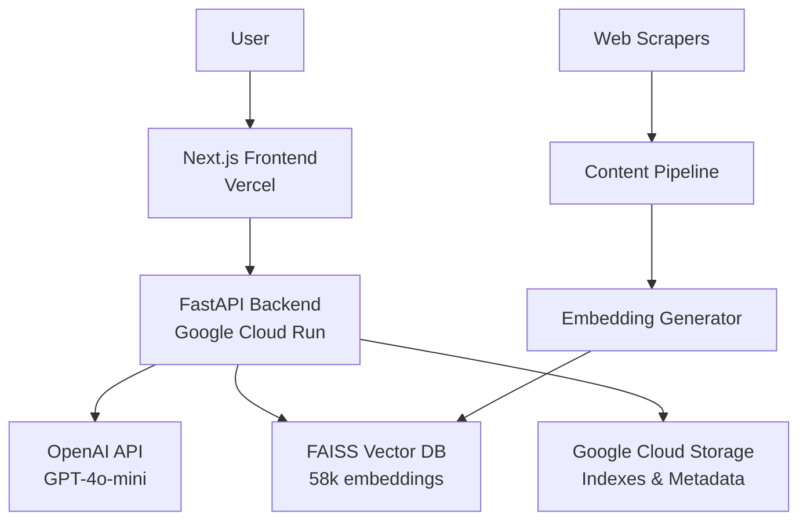

# Solo Founder - Gospel Guide AI

> **Mission## 🏗️ **Architecture Overview**

### 📡 **System Architecture**


### 🏛️ **Backend Architecture**

#### 🔍 **Search & AI Engine** (`backend/search/`)
- **`api.py`**: FastAPI server with streaming SSE endpoints
  - `/ask-stream` - Real-time AI responses with search results
  - `/search` - Vector similarity search across scripture corpus
  - CORS middleware for frontend integration
- **`scripture_search.py`**: FAISS-powered semantic search engine
  - OpenAI embeddings (`text-embedding-3-small`) for query vectorization
  - Metadata filtering by source, book, speaker, year
  - Cosine similarity ranking with configurable top-k results
- **`prompts.py`**: Intelligent prompt engineering system
  - Mode-specific system prompts (Youth, Scholar, General Conference)
  - Context window management for optimal AI responses
  - Source-aware filtering for targeted content delivery
- **`cloud_storage.py`**: Google Cloud Storage integration
  - Remote index management and versioning
  - Scalable metadata storage and retrieval

#### 🕷️ **Content Pipeline** (`backend/scripts/`)
- **`master_scraper.py`**: Orchestrates all content acquisition
  - Parallel scraping of LDS.org content
  - Test mode for development iterations
  - Progress tracking and error handling
- **Individual Scrapers**: Modular content extractors
  - `scrape_book_of_mormon.py`, `scrape_general_conference.py`, etc.
  - BeautifulSoup + lxml for robust HTML parsing
  - Structured JSON output with rich metadata
- **`build_embeddings.py`**: Vector index construction
  - Batch processing of 58k+ scripture segments
  - FAISS IndexFlatIP for cosine similarity search
  - Metadata persistence with pickle serialization

#### 📊 **Data Layer**
- **Content Storage**: 45MB+ of structured LDS content (JSON)
- **Vector Index**: FAISS binary index with 1536-dim embeddings
- **Metadata**: Pickle-serialized Python objects for fast lookup
- **Configuration**: JSON-based index configuration and versioning

### 🎨 **Frontend Architecture**

#### ⚛️ **Next.js 16 Application** (`frontend/src/`)
- **App Router**: Modern Next.js file-based routing
- **TypeScript**: Full type safety across components and services
- **Tailwind CSS 4**: Utility-first styling with custom neutral theme
- **Server-Side Rendering**: Optimized SEO and performance

#### 🧩 **Component Architecture**
- **`ChatInterface.tsx`**: Main conversation component
  - Real-time streaming with Server-Sent Events
  - ReactMarkdown integration for rich text formatting
  - Message history with search result citations
  - Mode selection and source filtering UI
- **`Sidebar.tsx`**: Source selection interface
  - Toggle-based filtering (General Conference, Standard Works)
  - Dynamic source count tracking
  - Responsive design with neutral color scheme

#### 🔌 **API Integration** (`services/api.ts`)
- **Streaming API Client**: Custom SSE implementation
- **Request/Response Types**: Full TypeScript interfaces
- **Mode Mapping**: Frontend mode translation to backend filters
- **Error Handling**: Comprehensive HTTP and stream error management

### 🚀 **Deployment Architecture**

#### 🌐 **Frontend Deployment** (Vercel)
- **Auto-Deploy**: GitHub main branch triggers
- **Edge Functions**: Global CDN distribution
- **Environment Variables**: Secure API endpoint configuration
- **Build Optimization**: Next.js static optimization

#### ⚡ **Backend Deployment** (Google Cloud Run)
- **Containerized FastAPI**: Docker-based deployment
- **Serverless Scaling**: 0-to-N instance auto-scaling
- **Environment Security**: Cloud-based secret management
- **Health Checks**: Automated service monitoring

### 🔧 **Development Workflow**

```bash
# Backend Development
cd backend/search
export OPENAI_API_KEY="your-key"
pip install -r requirements.txt
python3 api.py

# Frontend Development  
cd frontend
npm install
npm run dev

# Content Pipeline
cd backend/scripts
python3 master_scraper.py --test
python3 ../search/build_embeddings.py
```

## 📁 **Detailed Project Structure**

```
solo_founder/
├── README.md                      # 📋 Project documentation
├── .gitignore                     # 🔒 Security patterns
│
├── backend/                       # 🐍 Python Backend
│   ├── deploy.sh                  # 🚀 Cloud Run deployment
│   ├── Dockerfile                 # 🐳 Container config
│   ├── README.md                  # 📖 Backend docs
│   │
│   ├── scripts/                   # 🕷️ Content Acquisition
│   │   ├── master_scraper.py      # 🎯 Orchestration engine
│   │   ├── requirements.txt       # 📦 Scraper dependencies
│   │   ├── scrape_*.py           # 📚 Individual scrapers
│   │   └── content/              # 💾 Raw JSON content
│   │       ├── book_of_mormon.json
│   │       ├── general_conference.json
│   │       └── complete_lds_content.json
│   │
│   ├── search/                    # 🔍 AI Search Engine
│   │   ├── api.py                # 🌐 FastAPI server
│   │   ├── scripture_search.py   # 📊 Vector search
│   │   ├── prompts.py           # 🧠 AI prompt system
│   │   ├── cloud_storage.py     # ☁️ GCS integration
│   │   ├── build_embeddings.py  # 🔢 Vector index builder
│   │   ├── test_*.py            # 🧪 Development tests
│   │   ├── requirements.txt     # 📦 API dependencies
│   │   └── indexes/             # 💾 FAISS vector database
│   │       ├── scripture_index.faiss
│   │       ├── scripture_metadata.pkl
│   │       └── config.json
│   │
│   └── src/                      # 📚 Shared libraries
│       └── lib/
│           └── prompts.ts       # 📝 TypeScript prompts
│
├── frontend/                     # ⚛️ Next.js Frontend
│   ├── package.json             # 📦 Dependencies
│   ├── next.config.ts           # ⚙️ Next.js config
│   ├── tsconfig.json           # 🔧 TypeScript config
│   ├── vercel.json             # 🚀 Vercel deployment
│   ├── eslint.config.mjs       # ✨ Code quality
│   ├── postcss.config.mjs      # 🎨 CSS processing
│   ├── README.md               # 📖 Frontend docs
│   │
│   ├── public/                 # 🌐 Static assets
│   │   ├── christ.jpeg         # 🖼️ Logo image
│   │   └── *.svg              # 📐 Icon assets
│   │
│   └── src/                    # 💻 Application source
│       ├── app/                # 🏠 Next.js App Router
│       │   ├── layout.tsx      # 📱 Root layout
│       │   ├── page.tsx        # 🏡 Home page
│       │   ├── globals.css     # 🎨 Global styles
│       │   └── favicon.ico     # 🌟 Browser icon
│       │
│       ├── components/         # 🧩 React components
│       │   ├── ChatInterface.tsx # 💬 Main chat UI
│       │   └── Sidebar.tsx      # 📋 Source selector
│       │
│       └── services/           # 🔌 API integration
│           └── api.ts          # 📡 HTTP client
```

## 🎯 **Business Model**Ship a paid, production-ready LDS AI Scripture Study App in <14 days

## 🎯 **Project Status: ✅ COMPLETE & DEPLOYED**

**November 29, 2025** - Full-stack AI application successfully deployed and functional.

### 🚀 **Live Deployments**
- **🌐 Frontend**: https://vercel.com/derick-jones-projects/solo-founder (Vercel)
- **🔌 API**: https://gospel-guide-api-273320302933.us-central1.run.app (Google Cloud Run)
- **📚 Repository**: https://github.com/derickjones/solo_founder

### ✅ **Fully Operational Features**
- **🧠 AI-Powered Responses**: OpenAI GPT-4o-mini generates intelligent answers with proper LDS citations
- **⚡ Real-Time Streaming**: Server-Sent Events for live response generation  
- **📖 Complete LDS Library**: 58,088 scripture segments with FAISS vector search
- **🎯 8 Specialized Modes**: Default, Book of Mormon only, General Conference only, etc.
- **🔍 Smart Citations**: Exact references like "(Oct 2016, President Dieter F. Uchtdorf, 'Fourth Floor, Last Door')"
- **🎨 Dark Theme UI**: Modern chat interface with streaming responses
- **🔐 Secure Deployment**: Environment-based API key management

## 📁 **Project Structure**

```
solo_founder/
├── README.md                # 📋 Main project documentation  
├── backend/                 # 🐍 Python FastAPI Backend
│   ├── search/              # 🔍 AI search & response system
│   │   ├── api.py          # 🌐 FastAPI endpoints with streaming
│   │   ├── prompts.py      # 🧠 OpenAI prompt system  
│   │   ├── scripture_search.py # 📚 FAISS vector search
│   │   └── indexes/        # 💾 58,088 scripture embeddings
│   ├── scripts/            # 🕷️ Web scrapers + content pipeline
│   ├── deploy.sh           # 🚀 Google Cloud Run deployment
│   └── Dockerfile          # 🐳 Container configuration
│
├── frontend/               # ⚛️ Next.js React Frontend  
│   ├── src/
│   │   ├── components/     # 🧩 ChatInterface with streaming
│   │   ├── app/           # 📱 Next.js 15 app structure
│   │   └── services/      # 🔌 API integration
│   ├── vercel.json        # ⚡ Auto-deploy configuration
│   └── package.json       # 📦 Dependencies
│
└── .gitignore             # � Security & clean repo
```

## 🎯 **Business Model**
- **Free Tier**: 5 queries/day, basic search modes
- **Premium Monthly**: $7.99/month, unlimited queries + all specialized modes  
- **Lifetime Access**: $99 (limited to 500 users), advanced study tools

## 🔧 **Tech Stack & Dependencies**

### � **Backend Technologies**
- **FastAPI 0.104+**: Modern async web framework with automatic OpenAPI docs
- **OpenAI 1.0+**: GPT-4o-mini integration with streaming responses  
- **FAISS 1.7+**: Facebook's vector similarity search (CPU-optimized)
- **NumPy 1.24+**: Numerical computing for embedding operations
- **Google Cloud Storage 2.10+**: Scalable index and metadata storage
- **BeautifulSoup4 4.12+**: Robust HTML parsing for content scraping
- **Uvicorn**: High-performance ASGI server with auto-reload
- **Pydantic 2.4+**: Data validation and serialization

### ⚛️ **Frontend Technologies**  
- **Next.js 16.0.5**: React framework with App Router and SSR
- **React 19.2.0**: Latest React with concurrent features
- **TypeScript 5**: Full type safety and developer experience
- **Tailwind CSS 4**: Utility-first styling with custom neutral theme
- **Heroicons 2.2**: Consistent icon library from Tailwind team
- **ReactMarkdown 10.1**: Rich text rendering for AI responses

### ☁️ **Infrastructure & Deployment**
- **Google Cloud Run**: Serverless container platform with auto-scaling
- **Vercel**: Edge-optimized Next.js hosting with auto-deployment
- **Docker**: Containerized backend for consistent deployments
- **GitHub Actions**: CI/CD pipeline for automated deployments

### 🔍 **AI & Search Pipeline**
- **OpenAI Embeddings**: `text-embedding-3-small` (1536 dimensions)
- **Vector Database**: FAISS IndexFlatIP for cosine similarity
- **Content Sources**: 58,088+ scripture segments from LDS.org
- **Streaming**: Server-Sent Events for real-time AI responses

## 🚀 **Quick Start**

### Backend (API Server)
```bash
cd backend/search
export OPENAI_API_KEY="your-openai-api-key"
pip install -r requirements.txt
python3 -c "
import uvicorn
from api import app
uvicorn.run(app, host='127.0.0.1', port=8080)
"
```

### Frontend (Next.js)
```bash  
cd frontend
npm install
npm run dev
```

## 📊 **Performance Metrics**
- **⚡ Response Time**: ~2-3 seconds for AI-generated responses
- **📚 Content Coverage**: 58,088 scripture segments across all standard works
- **🎯 Search Accuracy**: Vector similarity with contextual AI interpretation
- **💻 Streaming**: Real-time response generation with Server-Sent Events

---

**🎯 Goal**: Generate $49.5k in first 48 hours with 500 lifetime licenses.

**✅ Status**: Ready for production launch! 🚀